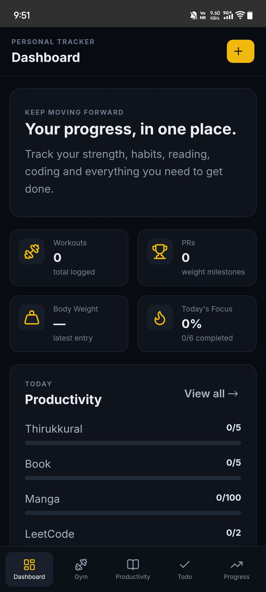
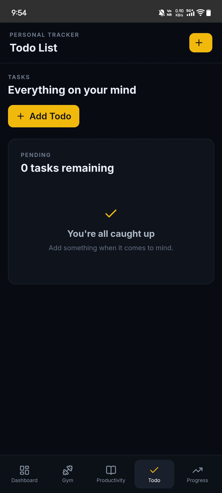
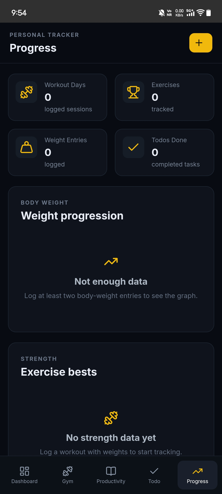
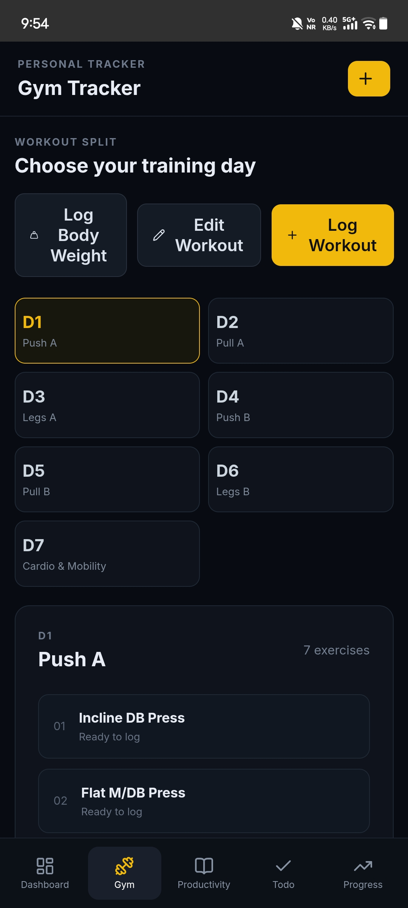
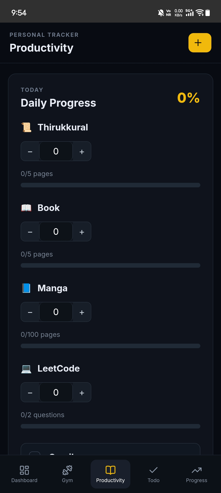

# 🚀 MY PROGRESS

**MY PROGRESS** is a personal productivity and progress-tracking application designed to help manage tasks, routines, habits, goals, and daily progress in one place.

The application is built using **React + Vite** and packaged as an **Android application using Capacitor**.

---

## ✨ Features

- 📝 Todo and task management
- 📊 Progress tracking
- 🔄 Routine management
- 🎯 Goal tracking
- 📅 Daily productivity management
- 📈 Progress statistics
- 📱 Android application
- 💻 Web application
- ⚡ Fast and responsive interface
- 💾 Local application data
- 🎨 Modern user interface

---

## 🛠️ Technologies Used

### Frontend

- React
- Vite
- JavaScript
- HTML
- CSS

### Mobile

- Capacitor
- Android
- Android Studio

### Development Tools

- Node.js
- npm
- Git
- GitHub

---

# 🚀 Getting Started

## Prerequisites

Make sure the following are installed on your computer:

- Node.js
- npm
- Git
- Android Studio (for Android development)

---

# 💻 Installation

## 1. Clone the Repository

```bash
git clone https://github.com/Naraender-AI/my-progress-app.git
```

## 2. Move Into the Project Directory

```bash
cd my-progress-app
```

## 3. Install Dependencies

```bash
npm install
```

---

# 🌐 Run the Web Application

Start the Vite development server:

```bash
npm run dev
```

Vite will provide a local development URL in the terminal.

Open that URL in your browser to run **MY PROGRESS**.

---

# 🏗️ Build the Application

Create a production build:

```bash
npm run build
```

The production files will be generated inside:

```text
dist/
```

---

# 📱 Android Application

**MY PROGRESS** uses **Capacitor** to package the React web application as an Android application.

After making changes to the web application, build the project:

```bash
npm run build
```

Then synchronize the web application with the Android project:

```bash
npx cap sync android
```

Open the Android project in Android Studio:

```bash
npx cap open android
```

The application can then be run using:

- Android Emulator
- Physical Android Device

---

# 🔄 Development Workflow

A typical development workflow is:

```text
Make changes
     ↓
Test in browser
     ↓
npm run build
     ↓
npx cap sync android
     ↓
Test Android application
     ↓
git add .
     ↓
git commit
     ↓
git push
```

---

# 🌳 Git Workflow

## Check Repository Status

```bash
git status
```

## Add Changes

```bash
git add .
```

## Commit Changes

```bash
git commit -m "Describe your changes"
```

## Push Changes to GitHub

```bash
git push
```

---

# 📸 Screenshots

Here are some screenshots of **MY PROGRESS**.

## 🏠 Dashboard



---

## 📝 Todo



---

## 📊 Progress Tracking



---

## 🔄 Routines



---

## 🎯 Goals



---

# 🗂️ Project Structure

```text
my-progress-app/
│
├── android/
│   └── Android / Capacitor project
│
├── screenshots/
│   ├── dashboard.png
│   ├── todo.png
│   ├── progress.png
│   ├── routines.png
│   └── goals.png
│
├── public/
│   └── Public assets
│
├── src/
│   ├── assets/
│   ├── App.jsx
│   ├── App.css
│   ├── index.css
│   └── main.jsx
│
├── index.html
├── capacitor.config.json
├── package.json
├── package-lock.json
├── vite.config.js
├── README.md
└── .gitignore
```

---

# 🗺️ Future Development

Planned improvements may include:

- 📝 Improved task management
- ✅ Advanced todo functionality
- 🔄 Habit tracking
- 📅 Routine tracking
- 🎯 Goal tracking
- 📊 More detailed progress statistics
- 🗓️ Calendar integration
- 🔔 Notifications and reminders
- 💾 Improved data backup
- ☁️ Cloud synchronization
- 👤 User accounts
- 📱 Improved Android UI
- 🎨 Additional customization options
- 🚀 Production release

---

# 🎯 Project Goal

The long-term goal of **MY PROGRESS** is to create a single application where personal productivity, routines, habits, goals, and progress can be managed and visualized easily.

Instead of using multiple applications for different parts of personal development, **MY PROGRESS** aims to bring everything together into one simple system.

The goal is simple:

> **Plan → Do → Track → Improve.**

---

# 📦 Repository

GitHub Repository:

https://github.com/Naraender-AI/my-progress-app

---

# 👨‍💻 Developer

**Naraender**

GitHub:

https://github.com/Naraender-AI

---

# 📄 License

This project is currently a personal project.

License information can be added when the project is prepared for public distribution.

---

# ⭐ MY PROGRESS

**Plan → Do → Track → Improve. 🚀**
